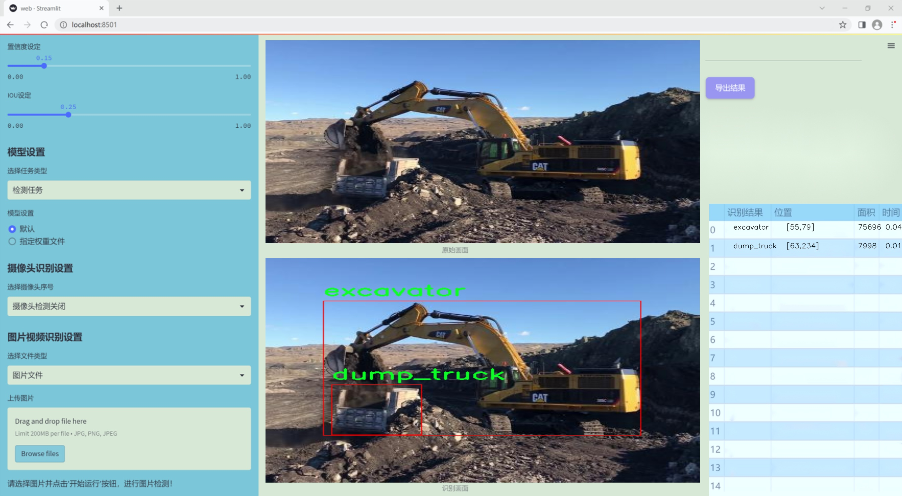

# 改进yolo11-DySnakeConv等200+全套创新点大全：工地机械检测系统源码＆数据集全套

### 1.图片效果展示





##### 项目来源 **[人工智能促进会 2024.10.22](https://kdocs.cn/l/cszuIiCKVNis)**

##### 注意：由于项目一直在更新迭代，上面“1.图片效果展示”和“2.视频效果展示”展示的系统图片或者视频可能为老版本，新版本在老版本的基础上升级如下：（实际效果以升级的新版本为准）

  （1）适配了YOLOV11的“目标检测”模型和“实例分割”模型，通过加载相应的权重（.pt）文件即可自适应加载模型。

  （2）支持“图片识别”、“视频识别”、“摄像头实时识别”三种识别模式。

  （3）支持“图片识别”、“视频识别”、“摄像头实时识别”三种识别结果保存导出，解决手动导出（容易卡顿出现爆内存）存在的问题，识别完自动保存结果并导出到tempDir中。

  （4）支持Web前端系统中的标题、背景图等自定义修改。

  另外本项目提供训练的数据集和训练教程,暂不提供权重文件（best.pt）,需要您按照教程进行训练后实现图片演示和Web前端界面演示的效果。

### 2.视频效果展示

[2.1 视频效果展示](https://www.bilibili.com/video/BV1RsyJYYEmz/)

### 3.背景

研究背景与意义

随着城市化进程的加快，建筑工地的机械设备种类和数量不断增加，如何高效、准确地监测和管理这些设备成为了一个亟待解决的问题。传统的人工监测方法不仅耗时耗力，而且容易出现遗漏和错误，难以满足现代建筑工地对安全性和效率的高要求。因此，基于计算机视觉的自动化检测系统应运而生，成为提升工地管理水平的重要工具。

本研究旨在基于改进的YOLOv11（You Only Look Once Version 11）模型，构建一个高效的工地机械检测系统。YOLO系列模型以其快速和准确的目标检测能力而广受欢迎，适用于实时监控和数据分析。通过对YOLOv11的改进，我们期望在保持高检测精度的同时，进一步提升模型的实时处理能力，以适应工地环境中复杂多变的光照和背景条件。

在数据集方面，本研究使用了名为“acid7000”的数据集，其中包含3000张工地机械设备的图像，涵盖了多种类别，包括挖掘机、推土机、混凝土车、塔式起重机等。这些类别的选择反映了当前建筑工地上常见的机械设备，能够为模型的训练提供丰富的样本支持。通过对这些图像的分析与处理，模型将能够学习到不同机械设备的特征，从而实现准确的识别与分类。

本研究的意义在于，不仅能够提高工地机械的管理效率，降低人工成本，还能为工地安全提供保障。通过实时监测机械设备的运行状态，及时发现潜在的安全隐患，进而减少事故发生的概率。此外，该系统的成功应用也为其他领域的目标检测提供了借鉴，推动了计算机视觉技术在实际应用中的广泛发展。

### 4.数据集信息展示

##### 4.1 本项目数据集详细数据（类别数＆类别名）

nc: 4
names: ['concrete_mixer_truck', 'dump_truck', 'excavator', 'mobile_crane']


该项目为【目标检测】数据集，请在【训练教程和Web端加载模型教程（第三步）】这一步的时候按照【目标检测】部分的教程来训练

##### 4.2 本项目数据集信息介绍

本项目数据集信息介绍

在本项目中，我们使用的数据集名为“acid7000”，旨在为改进YOLOv11的工地机械检测系统提供高质量的训练数据。该数据集专注于四种主要的工地机械类别，具体包括混凝土搅拌车、翻斗车、挖掘机和移动起重机。这些类别的选择不仅反映了现代建筑工地上常见的机械设备，也为目标检测模型的训练提供了丰富的多样性和复杂性。

“acid7000”数据集包含了大量的图像样本，涵盖了不同工地环境、天气条件和机械工作状态下的图像。这种多样性使得模型在实际应用中能够更好地适应各种场景，提高了其鲁棒性和准确性。每个类别的样本均经过精心标注，确保在训练过程中，模型能够准确识别和分类不同类型的工地机械。具体而言，混凝土搅拌车的图像展示了其在施工现场的多种作业状态，翻斗车则展现了其在运输材料时的不同角度和位置，挖掘机的图像则涵盖了挖掘和搬运的多个环节，而移动起重机则展示了其在高空作业时的复杂姿态。

通过对“acid7000”数据集的深入分析和利用，我们期望能够显著提升YOLOv11在工地机械检测任务中的性能。数据集的设计不仅考虑了图像的多样性和复杂性，还注重了标注的准确性和一致性，为后续的模型训练和评估奠定了坚实的基础。最终，我们希望通过这一数据集的有效应用，推动工地机械检测技术的发展，为智能建筑和自动化施工提供更为强大的技术支持。


### 5.全套项目环境部署视频教程（零基础手把手教学）

[5.1 所需软件PyCharm和Anaconda安装教程（第一步）](https://www.bilibili.com/video/BV1BoC1YCEKi/?spm_id_from=333.999.0.0&vd_source=bc9aec86d164b67a7004b996143742dc)


[5.2 安装Python虚拟环境创建和依赖库安装视频教程（第二步）](https://www.bilibili.com/video/BV1ZoC1YCEBw?spm_id_from=333.788.videopod.sections&vd_source=bc9aec86d164b67a7004b996143742dc)

### 6.改进YOLOv11训练教程和Web_UI前端加载模型教程（零基础手把手教学）

[6.1 改进YOLOv11训练教程和Web_UI前端加载模型教程（第三步）](https://www.bilibili.com/video/BV1BoC1YCEhR?spm_id_from=333.788.videopod.sections&vd_source=bc9aec86d164b67a7004b996143742dc)


按照上面的训练视频教程链接加载项目提供的数据集，运行train.py即可开始训练



     Epoch   gpu_mem       box       obj       cls    labels  img_size
     1/200     20.8G   0.01576   0.01955  0.007536        22      1280: 100%|██████████| 849/849 [14:42<00:00,  1.04s/it]
               Class     Images     Labels          P          R     mAP@.5 mAP@.5:.95: 100%|██████████| 213/213 [01:14<00:00,  2.87it/s]
                 all       3395      17314      0.994      0.957      0.0957      0.0843

     Epoch   gpu_mem       box       obj       cls    labels  img_size
     2/200     20.8G   0.01578   0.01923  0.007006        22      1280: 100%|██████████| 849/849 [14:44<00:00,  1.04s/it]
               Class     Images     Labels          P          R     mAP@.5 mAP@.5:.95: 100%|██████████| 213/213 [01:12<00:00,  2.95it/s]
                 all       3395      17314      0.996      0.956      0.0957      0.0845

     Epoch   gpu_mem       box       obj       cls    labels  img_size
     3/200     20.8G   0.01561    0.0191  0.006895        27      1280: 100%|██████████| 849/849 [10:56<00:00,  1.29it/s]
               Class     Images     Labels          P          R     mAP@.5 mAP@.5:.95: 100%|███████   | 187/213 [00:52<00:00,  4.04it/s]
                 all       3395      17314      0.996      0.957      0.0957      0.0845


###### [项目数据集下载链接](https://kdocs.cn/l/cszuIiCKVNis)

### 7.原始YOLOv11算法讲解


###### YOLOv11改进方向

与YOLOv 10相比，YOLOv 11有了巨大的改进，包括但不限于：

  * 增强的模型结构：模型具有改进的模型结构，以获取图像处理并形成预测
  * GPU优化：这是现代ML模型的反映，GPU训练ML模型在速度和准确性上都更好。
  * 速度：YOLOv 11模型现在经过增强和GPU优化以用于训练。通过优化，这些模型比它们的前版本快得多。在速度上达到了25%的延迟减少！
  * 更少的参数：更少的参数允许更快的模型，但v11的准确性不受影响
  * 更具适应性：更多支持的任务YOLOv 11支持多种类型的任务、多种类型的对象和多种类型的图像。

###### YOLOv11功能介绍

Glenn Jocher和他的团队制作了一个令人敬畏的YOLOv 11迭代，并且在图像人工智能的各个方面都提供了YOLO。YOLOv 11有多种型号，包括：

  * 对象检测-在训练时检测图像中的对象
  * 图像分割-超越对象检测，分割出图像中的对象
  * 姿态检测-当用点和线训练时绘制一个人的姿势
  * 定向检测（OBB）：类似于对象检测，但包围盒可以旋转
  * 图像分类-在训练时对图像进行分类

使用Ultralytics Library，这些模型还可以进行优化，以：

  * 跟踪-可以跟踪对象的路径
  * 易于导出-库可以以不同的格式和目的导出
  * 多场景-您可以针对不同的对象和图像训练模型

此外，Ultralytics还推出了YOLOv 11的企业模型，该模型将于10月31日发布。这将与开源的YOLOv
11模型并行，但将拥有更大的专有Ultralytics数据集。YOLOv 11是“建立在过去的成功”的其他版本的之上。

###### YOLOv11模型介绍

YOLOv 11附带了边界框模型（无后缀），实例分割（-seg），姿态估计（-pose），定向边界框（-obb）和分类（-cls）。

这些也有不同的尺寸：纳米（n），小（s），中（m），大（l），超大（x）。


YOLOv11模型

###### YOLOv11与前版本对比

与YOLOv10和YOLOv8相比，YOLOv11在Ultralytics的任何帖子中都没有直接提到。所以我会收集所有的数据来比较它们。感谢Ultralytics：

**检测：**


YOLOv11检测统计


YOLOv10检测统计

其中，Nano的mAPval在v11上为39.5，v10上为38.5；Small为47.0 vs 46.3，Medium为51.5 vs
51.1，Large为53.4 vs 53.2，Extra Large为54.7vs
54.4。现在，这可能看起来像是一种增量增加，但小小数的增加可能会对ML模型产生很大影响。总体而言，YOLOv11以0.3
mAPval的优势追平或击败YOLOv10。

现在，我们必须看看速度。在延迟方面，Nano在v11上为1.55 , v10上为1.84，Small为2.46 v2.49，Medium为4.70
v4.74，Large为6.16 v7.28，Extra Large为11.31
v10.70。延迟越低越好。YOLOv11提供了一个非常低的延迟相比，除了特大做得相当差的前身。

总的来说，Nano模型是令人振奋的，速度更快，性能相当。Extra Large在性能上有很好的提升，但它的延迟非常糟糕。

**分割：**


YOLOV11 分割统计


YOLOV9 分割统计


YOLOV8 分割数据

总体而言，YOLOv 11上的分割模型在大型和超大型模型方面比上一代YOLOv 8和YOLOv 9做得更好。

YOLOv 9 Segmentation没有提供任何关于延迟的统计数据。比较YOLOv 11延迟和YOLOv 8延迟，发现YOLOv 11比YOLOv
8快得多。YOLOv 11将大量GPU集成到他们的模型中，因此期望他们的模型甚至比CPU测试的基准更快！

姿态估计：


YOLOV11姿态估计统计


YOLOV8姿态估计统计

YOLOv 11的mAP 50 -95统计量也逐渐优于先前的YOLOv 8（除大型外）。然而，在速度方面，YOLOv
11姿势可以最大限度地减少延迟。其中一些延迟指标是版本的1/4！通过对这些模型进行GPU训练优化，我可以看到指标比显示的要好得多。

**定向边界框：**


YOLOv11 OBB统计


YOLOv8 OBB统计

OBB统计数据在mAP
50上并不是很好，只有非常小的改进，在某种程度上小于检测中的微小改进。然而，从v8到v11的速度减半，这表明YOLOv11在速度上做了很多努力。

**最后，分类：**


YOLOv 11 CLS统计


YOLOv8 CLS统计

从v8到v11，准确性也有了微小的提高。然而，速度大幅上升，CPU速度更快的型号。


### 8.200+种全套改进YOLOV11创新点原理讲解

#### 8.1 200+种全套改进YOLOV11创新点原理讲解大全

由于篇幅限制，每个创新点的具体原理讲解就不全部展开，具体见下列网址中的改进模块对应项目的技术原理博客网址【Blog】（创新点均为模块化搭建，原理适配YOLOv5~YOLOv11等各种版本）

[改进模块技术原理博客【Blog】网址链接](https://gitee.com/qunmasj/good)


#### 8.2 精选部分改进YOLOV11创新点原理讲解

###### 这里节选部分改进创新点展开原理讲解(完整的改进原理见上图和[改进模块技术原理博客链接](https://gitee.com/qunmasj/good)【如果此小节的图加载失败可以通过CSDN或者Github搜索该博客的标题访问原始博客，原始博客图片显示正常】


### 感受野注意力卷积（RFAConv)
#### 标准卷积操作回顾
标准的卷积操作是构造卷积神经网络的基本构件。它利用具有共享参数的滑动窗口提取特征信息，克服了全连通层构造神经网络固有的参数多、计算开销大的问题。设 X R∈C×H×W
表示输入特征图，其中C、H、W分别表示特征图的通道数、高度、宽度。为了清楚地演示卷积核的特征提取过程，我们使用 C = 1 的例子。从每个接受域滑块中提取特征信息的卷积运算可以表示为:


这里，Fi 表示计算后每个卷积滑块得到的值，Xi 表示每个滑块内对应位置的像素值，K表示卷积核，S表示卷积核中的参数个数，N表示接收域滑块的总数。可以看出，每个滑块内相同位置的 feature共享相同的参数Ki。因此，标准的卷积运算并不能捕捉到不同位置所带来的信息差异，这最终在一定程度上限制了卷积神经网络的性能。 

#### 空间注意力回顾
目前，空间注意机制是利用学习得到的注意图来突出每个特征的重要性。与前一节类似，这里以 C=1为例。突出关键特征的空间注意机制可以简单表述为:这里，Fi 表示加权运算后得到的值。xi 和Ai 表示输入特征图和学习到的注意图在不同位置的值，N为输入特征图的高和宽的乘积，表示像素值的总数。


#### 空间注意与标准卷积运算
将注意力机制整合到卷积神经网络中，可以提高卷积神经网络的性能。通过对标准卷积运算和现有空间注意机制的研究，我们认为空间注意机制有效地克服了卷积神经网络固有的参数共享的局限性。目前卷积神经网络中最常用的核大小是 1 × 1和3 × 3。在引入空间注意机制后，提取特征的卷积操作可以是 1 × 1或3 × 3卷积操作。为了直观地展示这个过程，在 1 × 1卷积运算的前面插入了空间注意机制。通过注意图对输入特征图(Re-weight“×”)进行加权运算，最后通过 1 × 1卷积运算提取接收域的滑块特征信息。整个过程可以简单地表示如下:


 这里卷积核K仅代表一个参数值。如果取A i× ki 的值作为一种新的卷积核参数，有趣的是它解决了 1×1卷积运算提取特征时的参数共享问题。然而，关于空间注意机制的传说到此结束。当空间注意机制被插入到3×3卷积运算前面时。具体情况如下:


如上所述，如果取A的值 i × ki (4)式作为一种新的卷积核参数，完全解决了大规模卷积核的参数共享问题。然而，最重要的一点是，卷积核在提取每个接受域滑块的特征时，会共享一些特征。换句话说，每个接收域滑块内都有一个重叠。仔细分析后会发现A12= a21， a13 = a22， a15 = a24……，在这种情况下，每个滑动窗口共享空间注意力地图的权重。因此，空间注意机制没有考虑整个接受域的空间特征，不能有效地解决大规模卷积核的参数共享问题。因此，空间注意机制的有效性受到限制。 

#### 创新空间注意力和标准卷积操作
该博客提出解决了现有空间注意机制的局限性，为空间处理提供了一种创新的解决方案。受RFA的启发，一系列空间注意机制被开发出来，可以进一步提高卷积神经网络的性能。RFA可以看作是一个轻量级即插即用模块，RFA设计的卷积运算(RFAConv)可以代替标准卷积来提高卷积神经网络的性能。因此，我们预测空间注意机制与标准卷积运算的结合将继续发展，并在未来带来新的突破。
接受域空间特征:为了更好地理解接受域空间特征的概念，我们将提供相关的定义。接收域空间特征是专门为卷积核设计的，并根据核大小动态生成。如图1所示，以3×3卷积核为例。在图1中，“Spatial Feature”指的是原始的Feature map。“接受域空间特征”是空间特征变换后的特征图。

 

由不重叠的滑动窗口组成。当使用 3×3卷积内核提取特征时，接收域空间特征中的每个 3×3大小窗口代表一个接收域滑块。接受域注意卷积(RFAConv):针对接受域的空间特征，我们提出了接受域注意卷积(RFA)。该方法不仅强调了接收域滑块内不同特征的重要性，而且对接收域空间特征进行了优先排序。通过该方法，完全解决了卷积核参数共享的问题。接受域空间特征是根据卷积核的大小动态生成的，因此，RFA是卷积的固定组合，不能与卷积操作的帮助分离，卷积操作同时依赖于RFA来提高性能，因此我们提出了接受场注意卷积(RFAConv)。具有3×3大小的卷积核的RFAConv整体结构如图所示。


目前，最广泛使用的接受域特征提取方法是缓慢的。经过大量的研究，我们开发了一种快速的方法，用分组卷积来代替原来的方法。具体来说，我们利用相应大小的分组卷积来动态生成基于接受域大小的展开特征。尽管与原始的无参数方法(如PyTorch提供的nn.())相比，该方法增加了一些参数，但它的速度要快得多。注意:如前一节所述，当使用 3×3卷积内核提取特征时，接收域空间特征中的每个 3×3大小窗口表示一个接收域滑块。而利用快速分组卷积提取感受野特征后，将原始特征映射为新的特征。最近的研究表明。交互信息可以提高网络性能，如[40,41,42]所示。同样，对于RFAConv来说，通过交互接受域特征信息来学习注意图可以提高网络性能。然而，与每个接收域特征交互会导致额外的计算开销，因此为了最小化计算开销和参数的数量，我们使用AvgPool来聚合每个接收域特征的全局信息。然后，使用 1×1 组卷积操作进行信息交互。最后，我们使用softmax来强调每个特征在接受域特征中的重要性。一般情况下，RFA的计算可以表示为:


这里gi×i 表示一个大小为 i×i的分组卷积，k表示卷积核的大小，Norm表示归一化，X表示输入的特征图，F由注意图 a相乘得到 rf 与转换后的接受域空间特征 Frf。与CBAM和CA不同，RFA能够为每个接受域特征生成注意图。卷积神经网络的性能受到标准卷积操作的限制，因为卷积操作依赖于共享参数，对位置变化带来的信息差异不敏感。然而，RFAConv通过强调接收域滑块中不同特征的重要性，并对接收域空间特征进行优先级排序，可以完全解决这个问题。通过RFA得到的feature map是接受域空间特征，在“Adjust Shape”后没有重叠。因此，学习到的注意图将每个接受域滑块的特征信息聚合起来。换句话说，注意力地图不再共享在每个接受域滑块。这完全弥补了现有 CA和CBAM注意机制的不足。RFA为标准卷积内核提供了显著的好处。而在调整形状后，特征的高度和宽度是 k倍，需要进行 stride = k的k × k卷积运算来提取特征信息。RFA设计的卷积运算RFAConv为卷积带来了良好的增益，对标准卷积进行了创新。
此外，我们认为现有的空间注意机制应该优先考虑接受域空间特征，以提高网络性能。众所周知，基于自注意机制的网络模型[43,44,45]取得了很大的成功，因为它解决了卷积参数共享的问题，并对远程信息进行建模。然而，自注意机制也为模型引入了显著的计算开销和复杂性。我们认为，将现有的空间注意机制的注意力引导到接受场空间特征上，可以以类似于自我注意的方式解决长期信息的参数共享和建模问题。与自我关注相比，这种方法需要的参数和计算资源少得多。答案如下:(1)将以接收场空间特征为中心的空间注意机制与卷积相结合，消除了卷积参数共享的问题。(2)现有的空间注意机制已经考虑了远程信息，可以通过全局平均池或全局最大池的方式获取全局信息，其中明确考虑了远程信息。因此，我们设计了新的 CBAM和CA模型，称为RFCBAM和RFCA，它们专注于接受域空间特征。与RFA类似，使用最终的k × k stride = k 的卷积运算来提取特征信息。这两种新的卷积方法的具体结构如图 3所示，我们称这两种新的卷积操作为 RFCBAMConv和RFCAConv。与原来的CBAM相比，我们在RFCBAM中使用SE attention来代替CAM。因为这样可以减少计算开销。此外，在RFCBAM中，通道注意和空间注意不是分开执行的。相反，它们是同时加权的，使得每个通道获得的注意力地图是不同的。


### 9.系统功能展示

图9.1.系统支持检测结果表格显示

  图9.2.系统支持置信度和IOU阈值手动调节

  图9.3.系统支持自定义加载权重文件best.pt(需要你通过步骤5中训练获得)

  图9.4.系统支持摄像头实时识别

  图9.5.系统支持图片识别

  图9.6.系统支持视频识别

  图9.7.系统支持识别结果文件自动保存

  图9.8.系统支持Excel导出检测结果数据


### 10. YOLOv11核心改进源码讲解

#### 10.1 kacn_conv.py

以下是对给定代码的核心部分进行分析和详细注释的结果：

```python
import torch
import torch.nn as nn

# 定义一个通用的多维卷积层类 KACNConvNDLayer
class KACNConvNDLayer(nn.Module):
    def __init__(self, conv_class, norm_class, input_dim, output_dim, degree, kernel_size,
                 groups=1, padding=0, stride=1, dilation=1,
                 ndim: int = 2, dropout=0.0):
        super(KACNConvNDLayer, self).__init__()
        
        # 初始化参数
        self.inputdim = input_dim  # 输入维度
        self.outdim = output_dim    # 输出维度
        self.degree = degree         # 多项式的度数
        self.kernel_size = kernel_size  # 卷积核大小
        self.padding = padding        # 填充
        self.stride = stride          # 步幅
        self.dilation = dilation      # 膨胀
        self.groups = groups          # 分组卷积的组数
        self.ndim = ndim              # 数据的维度（1D, 2D, 3D）
        self.dropout = None           # Dropout层初始化为None

        # 如果dropout大于0，则根据维度选择相应的Dropout层
        if dropout > 0:
            if ndim == 1:
                self.dropout = nn.Dropout1d(p=dropout)
            elif ndim == 2:
                self.dropout = nn.Dropout2d(p=dropout)
            elif ndim == 3:
                self.dropout = nn.Dropout3d(p=dropout)

        # 检查groups的有效性
        if groups <= 0:
            raise ValueError('groups must be a positive integer')
        if input_dim % groups != 0:
            raise ValueError('input_dim must be divisible by groups')
        if output_dim % groups != 0:
            raise ValueError('output_dim must be divisible by groups')

        # 创建分组归一化层
        self.layer_norm = nn.ModuleList([norm_class(output_dim // groups) for _ in range(groups)])

        # 创建多项式卷积层
        self.poly_conv = nn.ModuleList([conv_class((degree + 1) * input_dim // groups,
                                                   output_dim // groups,
                                                   kernel_size,
                                                   stride,
                                                   padding,
                                                   dilation,
                                                   groups=1,
                                                   bias=False) for _ in range(groups)])
        
        # 注册一个缓冲区，用于存储多项式的系数
        arange_buffer_size = (1, 1, -1,) + tuple(1 for _ in range(ndim))
        self.register_buffer("arange", torch.arange(0, degree + 1, 1).view(*arange_buffer_size))
        
        # 使用Kaiming均匀分布初始化卷积层的权重
        for conv_layer in self.poly_conv:
            nn.init.normal_(conv_layer.weight, mean=0.0, std=1 / (input_dim * (degree + 1) * kernel_size ** ndim))

    # 定义前向传播函数，处理每个组的输入
    def forward_kacn(self, x, group_index):
        x = torch.tanh(x)  # 应用tanh激活函数
        x = x.acos().unsqueeze(2)  # 计算反余弦并增加一个维度
        x = (x * self.arange).flatten(1, 2)  # 乘以多项式系数并展平
        x = x.cos()  # 计算余弦
        x = self.poly_conv[group_index](x)  # 通过对应的卷积层
        x = self.layer_norm[group_index](x)  # 归一化
        if self.dropout is not None:
            x = self.dropout(x)  # 应用dropout
        return x

    # 定义整体前向传播函数
    def forward(self, x):
        split_x = torch.split(x, self.inputdim // self.groups, dim=1)  # 按组分割输入
        output = []
        for group_ind, _x in enumerate(split_x):
            y = self.forward_kacn(_x.clone(), group_ind)  # 对每个组进行前向传播
            output.append(y.clone())  # 收集输出
        y = torch.cat(output, dim=1)  # 合并所有组的输出
        return y

# 3D卷积层的具体实现
class KACNConv3DLayer(KACNConvNDLayer):
    def __init__(self, input_dim, output_dim, kernel_size, degree=3, groups=1, padding=0, stride=1, dilation=1,
                 dropout=0.0):
        super(KACNConv3DLayer, self).__init__(nn.Conv3d, nn.BatchNorm3d,
                                              input_dim, output_dim,
                                              degree, kernel_size,
                                              groups=groups, padding=padding, stride=stride, dilation=dilation,
                                              ndim=3, dropout=dropout)

# 2D卷积层的具体实现
class KACNConv2DLayer(KACNConvNDLayer):
    def __init__(self, input_dim, output_dim, kernel_size, degree=3, groups=1, padding=0, stride=1, dilation=1,
                 dropout=0.0):
        super(KACNConv2DLayer, self).__init__(nn.Conv2d, nn.BatchNorm2d,
                                              input_dim, output_dim,
                                              degree, kernel_size,
                                              groups=groups, padding=padding, stride=stride, dilation=dilation,
                                              ndim=2, dropout=dropout)

# 1D卷积层的具体实现
class KACNConv1DLayer(KACNConvNDLayer):
    def __init__(self, input_dim, output_dim, kernel_size, degree=3, groups=1, padding=0, stride=1, dilation=1,
                 dropout=0.0):
        super(KACNConv1DLayer, self).__init__(nn.Conv1d, nn.BatchNorm1d,
                                              input_dim, output_dim,
                                              degree, kernel_size,
                                              groups=groups, padding=padding, stride=stride, dilation=dilation,
                                              ndim=1, dropout=dropout)
```

### 代码核心部分分析
1. **KACNConvNDLayer**: 这是一个通用的多维卷积层类，支持1D、2D和3D卷积。它通过多项式卷积和分组归一化来处理输入数据。

2. **初始化参数**: 在构造函数中，初始化了输入输出维度、卷积参数、分组数等，并创建了相应的归一化和卷积层。

3. **前向传播**: `forward_kacn` 方法实现了对每个分组的前向传播，应用了激活函数、卷积操作和归一化。

4. **子类实现**: `KACNConv1DLayer`、`KACNConv2DLayer` 和 `KACNConv3DLayer` 分别是1D、2D和3D卷积层的具体实现，继承自 `KACNConvNDLayer`。

通过这些核心部分的实现，代码提供了一种灵活的方式来构建多维卷积神经网络层。

这个程序文件 `kacn_conv.py` 定义了一系列用于卷积神经网络的层，主要包括 `KACNConvNDLayer` 及其子类 `KACNConv1DLayer`、`KACNConv2DLayer` 和 `KACNConv3DLayer`。这些层的设计旨在支持多维卷积操作，并结合了归一化和可选的 dropout 机制。

首先，`KACNConvNDLayer` 是一个通用的卷积层类，支持任意维度的卷积操作。它的构造函数接受多个参数，包括卷积类型、归一化类型、输入和输出维度、卷积核大小、分组数、填充、步幅、扩张率、维度数以及 dropout 比例。构造函数中对输入参数进行了有效性检查，例如确保分组数为正整数，并且输入和输出维度能够被分组数整除。

在初始化过程中，该类创建了多个模块，包括用于归一化的 `layer_norm` 和用于卷积的 `poly_conv`。这些卷积层的权重使用 Kaiming 正态分布初始化，以帮助模型在训练初期更好地收敛。此外，类中还注册了一个缓冲区 `arange`，用于后续的计算。

`forward_kacn` 方法实现了前向传播的核心逻辑。它首先对输入进行激活处理，然后通过一系列的数学变换和卷积操作，最终返回处理后的输出。在这个过程中，如果定义了 dropout，则会在输出中应用 dropout。

`forward` 方法则负责将输入数据分割成多个组，并对每个组调用 `forward_kacn` 方法进行处理，最后将所有组的输出拼接在一起。

接下来的三个类 `KACNConv1DLayer`、`KACNConv2DLayer` 和 `KACNConv3DLayer` 分别继承自 `KACNConvNDLayer`，并针对一维、二维和三维卷积进行了具体化。它们在构造函数中调用父类的构造函数，并传入相应的卷积和归一化类（如 `nn.Conv1d`、`nn.Conv2d` 和 `nn.Conv3d`），从而实现不同维度的卷积操作。

整体来看，这个文件提供了一种灵活的方式来构建支持多维卷积的神经网络层，适用于各种深度学习任务。通过组合不同的卷积和归一化层，用户可以方便地创建复杂的神经网络结构。

#### 10.2 revcol.py

以下是经过简化和注释的核心代码部分：

```python
import torch
import torch.nn as nn

# 定义一个用于反向传播的自定义函数
class ReverseFunction(torch.autograd.Function):
    @staticmethod
    def forward(ctx, run_functions, alpha, *args):
        # 解包运行函数和缩放因子
        l0, l1, l2, l3 = run_functions
        alpha0, alpha1, alpha2, alpha3 = alpha
        
        # 保存上下文信息
        ctx.run_functions = run_functions
        ctx.alpha = alpha
        
        # 确保输入参数数量正确
        assert len(args) == 5
        [x, c0, c1, c2, c3] = args
        
        # 使用无梯度上下文进行前向计算
        with torch.no_grad():
            c0 = l0(x, c1) + c0 * alpha0
            c1 = l1(c0, c2) + c1 * alpha1
            c2 = l2(c1, c3) + c2 * alpha2
            c3 = l3(c2, None) + c3 * alpha3
        
        # 保存计算结果以供反向传播使用
        ctx.save_for_backward(x, c0, c1, c2, c3)
        return x, c0, c1, c2, c3

    @staticmethod
    def backward(ctx, *grad_outputs):
        # 从上下文中恢复保存的张量
        x, c0, c1, c2, c3 = ctx.saved_tensors
        l0, l1, l2, l3 = ctx.run_functions
        alpha0, alpha1, alpha2, alpha3 = ctx.alpha
        
        # 解包梯度输出
        gx_right, g0_right, g1_right, g2_right, g3_right = grad_outputs
        
        # 反向传播计算
        g3_up = g3_right
        g3_left = g3_up * alpha3  # 使用缩放因子
        oup3 = l3(c2, None)
        torch.autograd.backward(oup3, g3_up, retain_graph=True)
        
        # 计算反向特征
        c3_left = (1 / alpha3) * (c3 - oup3)
        g2_up = g2_right + c2.grad
        g2_left = g2_up * alpha2
        
        # 继续反向传播
        c2_left = (1 / alpha2) * (c2 - l2(c1, c3_left))
        g1_up = g1_right + c1.grad
        g1_left = g1_up * alpha1
        
        # 反向传播到输入
        gx_up = x.grad
        
        return None, None, gx_up, g0_left, g1_left, g2_left, g3_left

# 定义网络的子模块
class SubNet(nn.Module):
    def __init__(self, channels, layers, kernel, first_col, save_memory) -> None:
        super().__init__()
        self.save_memory = save_memory
        
        # 定义缩放因子
        self.alpha0 = nn.Parameter(torch.ones((1, channels[0], 1, 1)), requires_grad=True)
        self.alpha1 = nn.Parameter(torch.ones((1, channels[1], 1, 1)), requires_grad=True)
        self.alpha2 = nn.Parameter(torch.ones((1, channels[2], 1, 1)), requires_grad=True)
        self.alpha3 = nn.Parameter(torch.ones((1, channels[3], 1, 1)), requires_grad=True)

        # 定义网络层
        self.level0 = Level(0, channels, layers, kernel, first_col)
        self.level1 = Level(1, channels, layers, kernel, first_col)
        self.level2 = Level(2, channels, layers, kernel, first_col)
        self.level3 = Level(3, channels, layers, kernel, first_col)

    def forward(self, *args):
        # 根据内存节省策略选择前向传播方式
        if self.save_memory:
            return self._forward_reverse(*args)
        else:
            return self._forward_nonreverse(*args)

# 定义主网络结构
class RevCol(nn.Module):
    def __init__(self, kernel='C2f', channels=[32, 64, 96, 128], layers=[2, 3, 6, 3], num_subnet=5, save_memory=True) -> None:
        super().__init__()
        self.num_subnet = num_subnet
        self.channels = channels
        self.layers = layers

        # 定义输入层
        self.stem = Conv(3, channels[0], k=4, s=4, p=0)

        # 添加子网络
        for i in range(num_subnet):
            first_col = (i == 0)
            self.add_module(f'subnet{str(i)}', SubNet(channels, layers, kernel, first_col, save_memory=save_memory))

    def forward(self, x):
        c0, c1, c2, c3 = 0, 0, 0, 0
        x = self.stem(x)        
        for i in range(self.num_subnet):
            c0, c1, c2, c3 = getattr(self, f'subnet{str(i)}')(x, c0, c1, c2, c3)       
        return [c0, c1, c2, c3]
```

### 代码注释说明：
1. **ReverseFunction**: 这个类实现了一个自定义的反向传播机制，主要用于在前向传播时保存状态，并在反向传播时使用这些状态来计算梯度。
2. **SubNet**: 这是一个子网络模块，包含多个层次结构，并且可以选择是否节省内存。
3. **RevCol**: 这是主网络结构，包含多个子网络和一个输入层。它负责将输入数据传递给各个子网络并收集输出。

以上代码通过定义自定义的前向和反向传播函数，实现了一个复杂的神经网络结构，适用于需要反向传播和内存优化的场景。

这个程序文件 `revcol.py` 是一个使用 PyTorch 构建的深度学习模型，主要实现了一个名为 RevCol 的神经网络架构。该架构包含多个子网络（SubNet），并且在前向传播过程中采用了反向传播（Reverse Function）技术，以节省内存并提高计算效率。

文件中首先导入了必要的 PyTorch 模块和自定义的卷积层、块等。接着定义了一些辅助函数，比如获取 GPU 状态、设置设备状态、分离和计算梯度等。这些函数为后续的模型训练和推理提供了基础支持。

`ReverseFunction` 类是一个自定义的 PyTorch 自动求导函数，负责实现模型的前向和反向传播。在前向传播中，它接受多个运行函数和 alpha 参数，计算输出并保存必要的状态以便在反向传播时使用。在反向传播中，它通过计算梯度并更新各层的参数，实现了反向传播的逻辑。这里的“反向”不仅仅是指反向传播的过程，还涉及到特征的反转，以便更好地利用网络的输出。

`Fusion` 类和 `Level` 类分别实现了特征融合和网络的不同层级结构。`Fusion` 类负责在不同层之间进行特征的上下采样，而 `Level` 类则定义了每一层的具体操作，包括卷积层的堆叠。`SubNet` 类则将多个层组合在一起，并根据是否需要节省内存来选择使用普通的前向传播或反向传播。

最后，`RevCol` 类是整个模型的核心，初始化时创建了多个子网络，并定义了输入的卷积层。其 `forward` 方法实现了整个网络的前向传播逻辑，通过依次调用每个子网络来处理输入数据，并返回每个子网络的输出。

整体来看，这个程序文件展示了如何利用 PyTorch 构建一个复杂的神经网络架构，采用了先进的内存管理技术以提高训练效率，适合用于需要处理大规模数据的深度学习任务。

#### 10.3 val.py

以下是经过简化和注释的核心代码部分，主要集中在 `DetectionValidator` 类的实现上：

```python
import os
import torch
from ultralytics.engine.validator import BaseValidator
from ultralytics.utils.metrics import DetMetrics, ConfusionMatrix
from ultralytics.utils import ops

class DetectionValidator(BaseValidator):
    """
    继承自 BaseValidator 类的检测模型验证器。
    """

    def __init__(self, dataloader=None, save_dir=None, pbar=None, args=None, _callbacks=None):
        """初始化检测模型，设置必要的变量和参数。"""
        super().__init__(dataloader, save_dir, pbar, args, _callbacks)
        self.metrics = DetMetrics(save_dir=self.save_dir)  # 初始化检测指标
        self.confusion_matrix = ConfusionMatrix(nc=len(args.names), conf=args.conf)  # 初始化混淆矩阵

    def preprocess(self, batch):
        """对输入图像批次进行预处理。"""
        # 将图像数据移动到设备上，并进行归一化处理
        batch["img"] = batch["img"].to(self.device, non_blocking=True) / 255
        return batch

    def postprocess(self, preds):
        """对预测结果应用非极大值抑制（NMS）。"""
        return ops.non_max_suppression(
            preds,
            self.args.conf,
            self.args.iou,
            multi_label=True,
            agnostic=self.args.single_cls,
            max_det=self.args.max_det,
        )

    def update_metrics(self, preds, batch):
        """更新检测指标。"""
        for si, pred in enumerate(preds):
            # 处理每个预测结果
            if len(pred) == 0:
                continue  # 如果没有预测结果，跳过

            # 准备真实标签和预测框
            pbatch = self._prepare_batch(si, batch)
            cls, bbox = pbatch.pop("cls"), pbatch.pop("bbox")

            # 计算指标
            stat = self._process_batch(pred, bbox, cls)
            self.metrics.process(**stat)  # 更新指标

    def _process_batch(self, detections, gt_bboxes, gt_cls):
        """
        处理每个批次的检测结果，返回正确预测的矩阵。
        """
        iou = ops.box_iou(gt_bboxes, detections[:, :4])  # 计算 IoU
        return self.match_predictions(detections[:, 5], gt_cls, iou)  # 匹配预测与真实标签

    def print_results(self):
        """打印每个类别的训练/验证集指标。"""
        LOGGER.info("Metrics results: %s", self.metrics.mean_results())  # 打印平均指标结果

    def finalize_metrics(self):
        """设置最终的指标值。"""
        self.metrics.confusion_matrix = self.confusion_matrix  # 设置混淆矩阵
```

### 代码说明：
1. **类初始化**：`__init__` 方法中调用父类的初始化方法，并设置检测指标和混淆矩阵。
2. **预处理**：`preprocess` 方法对输入图像进行设备转移和归一化处理。
3. **后处理**：`postprocess` 方法使用非极大值抑制来过滤掉冗余的检测框。
4. **更新指标**：`update_metrics` 方法处理每个预测结果，并更新检测指标。
5. **处理批次**：`_process_batch` 方法计算预测框与真实框之间的 IoU，并返回匹配结果。
6. **打印结果**：`print_results` 方法输出每个类别的平均指标结果。
7. **最终指标**：`finalize_metrics` 方法用于设置最终的混淆矩阵。

这些核心部分构成了 YOLO 检测模型验证的基础逻辑，确保模型在验证集上的性能评估。

这个程序文件 `val.py` 是一个用于验证目标检测模型（如 YOLO）的类 `DetectionValidator` 的实现。它继承自 `BaseValidator` 类，主要负责处理模型在验证集上的评估和性能统计。

在初始化方法中，类定义了一些重要的变量和设置，包括数据加载器、保存目录、进度条、参数和回调函数等。它还设置了一些与 COCO 数据集相关的标志和类映射，并初始化了一些评估指标，如检测指标和混淆矩阵。

`preprocess` 方法用于对输入的图像批次进行预处理，包括将图像数据转移到指定设备（如 GPU），进行数据类型转换，以及归一化处理。它还会根据需要进行自动标注。

`init_metrics` 方法用于初始化评估指标，检查数据集是否为 COCO 格式，并根据模型的类别名称设置相关的统计信息。

`get_desc` 方法返回一个格式化的字符串，用于描述每个类别的评估指标。

`postprocess` 方法应用非极大值抑制（NMS）来处理模型的预测输出，以减少重叠的边界框。

`_prepare_batch` 和 `_prepare_pred` 方法分别用于准备输入批次和预测结果，以便进行后续的评估。

`update_metrics` 方法是核心功能之一，它负责更新评估指标，处理每个批次的预测结果，并将其与真实标签进行比较。它还会根据需要保存预测结果到 JSON 或 TXT 文件中。

`finalize_metrics` 方法用于设置最终的评估指标和混淆矩阵。

`get_stats` 方法返回评估的统计信息和结果字典，统计每个类别的目标数量。

`print_results` 方法打印训练或验证集的每个类别的评估指标，并根据需要绘制混淆矩阵。

`_process_batch` 方法计算正确预测的矩阵，基于 IoU（交并比）来评估检测结果的准确性。

`build_dataset` 和 `get_dataloader` 方法用于构建数据集和数据加载器，以便在验证过程中使用。

`plot_val_samples` 和 `plot_predictions` 方法用于可视化验证样本和预测结果，生成相应的图像文件。

`save_one_txt` 和 `pred_to_json` 方法用于将 YOLO 的检测结果保存为特定格式的文本文件或 JSON 文件，以便后续分析和评估。

`eval_json` 方法用于评估 YOLO 输出的 JSON 格式结果，并返回性能统计信息，支持与 COCO API 进行集成以计算 mAP（平均精度）。

整体来看，这个文件提供了一个完整的框架，用于验证目标检测模型的性能，支持多种评估指标和结果保存格式，适用于使用 YOLO 模型进行目标检测的场景。

#### 10.4 kan_conv.py

以下是经过简化并添加详细中文注释的核心代码部分：

```python
import torch
import torch.nn as nn

class KANConvNDLayer(nn.Module):
    def __init__(self, conv_class, norm_class, input_dim, output_dim, spline_order, kernel_size,
                 groups=1, padding=0, stride=1, dilation=1,
                 ndim: int = 2, grid_size=5, base_activation=nn.GELU, grid_range=[-1, 1], dropout=0.0):
        super(KANConvNDLayer, self).__init__()
        
        # 初始化参数
        self.inputdim = input_dim  # 输入维度
        self.outdim = output_dim    # 输出维度
        self.spline_order = spline_order  # 样条阶数
        self.kernel_size = kernel_size  # 卷积核大小
        self.padding = padding  # 填充
        self.stride = stride  # 步幅
        self.dilation = dilation  # 膨胀
        self.groups = groups  # 分组数
        self.ndim = ndim  # 维度
        self.grid_size = grid_size  # 网格大小
        self.base_activation = base_activation()  # 基础激活函数
        self.grid_range = grid_range  # 网格范围

        # 初始化dropout层
        self.dropout = None
        if dropout > 0:
            if ndim == 1:
                self.dropout = nn.Dropout1d(p=dropout)
            elif ndim == 2:
                self.dropout = nn.Dropout2d(p=dropout)
            elif ndim == 3:
                self.dropout = nn.Dropout3d(p=dropout)

        # 检查分组数和维度的有效性
        if groups <= 0:
            raise ValueError('groups must be a positive integer')
        if input_dim % groups != 0:
            raise ValueError('input_dim must be divisible by groups')
        if output_dim % groups != 0:
            raise ValueError('output_dim must be divisible by groups')

        # 创建基础卷积层和样条卷积层
        self.base_conv = nn.ModuleList([conv_class(input_dim // groups,
                                                   output_dim // groups,
                                                   kernel_size,
                                                   stride,
                                                   padding,
                                                   dilation,
                                                   groups=1,
                                                   bias=False) for _ in range(groups)])

        self.spline_conv = nn.ModuleList([conv_class((grid_size + spline_order) * input_dim // groups,
                                                     output_dim // groups,
                                                     kernel_size,
                                                     stride,
                                                     padding,
                                                     dilation,
                                                     groups=1,
                                                     bias=False) for _ in range(groups)])

        # 创建归一化层和激活层
        self.layer_norm = nn.ModuleList([norm_class(output_dim // groups) for _ in range(groups)])
        self.prelus = nn.ModuleList([nn.PReLU() for _ in range(groups)])

        # 生成样条网格
        h = (self.grid_range[1] - self.grid_range[0]) / grid_size
        self.grid = torch.linspace(
            self.grid_range[0] - h * spline_order,
            self.grid_range[1] + h * spline_order,
            grid_size + 2 * spline_order + 1,
            dtype=torch.float32
        )

        # 使用Kaiming均匀分布初始化卷积层权重
        for conv_layer in self.base_conv:
            nn.init.kaiming_uniform_(conv_layer.weight, nonlinearity='linear')

        for conv_layer in self.spline_conv:
            nn.init.kaiming_uniform_(conv_layer.weight, nonlinearity='linear')

    def forward_kan(self, x, group_index):
        # 基础卷积层的前向传播
        base_output = self.base_conv[group_index](self.base_activation(x))

        # 扩展维度以进行样条操作
        x_uns = x.unsqueeze(-1)
        target = x.shape[1:] + self.grid.shape
        grid = self.grid.view(*list([1 for _ in range(self.ndim + 1)] + [-1, ])).expand(target).contiguous().to(x.device)

        # 计算样条基
        bases = ((x_uns >= grid[..., :-1]) & (x_uns < grid[..., 1:])).to(x.dtype)

        # 计算多阶样条基
        for k in range(1, self.spline_order + 1):
            left_intervals = grid[..., :-(k + 1)]
            right_intervals = grid[..., k:-1]
            delta = torch.where(right_intervals == left_intervals, torch.ones_like(right_intervals),
                                right_intervals - left_intervals)
            bases = ((x_uns - left_intervals) / delta * bases[..., :-1]) + \
                    ((grid[..., k + 1:] - x_uns) / (grid[..., k + 1:] - grid[..., 1:(-k)]) * bases[..., 1:])
        bases = bases.contiguous()
        bases = bases.moveaxis(-1, 2).flatten(1, 2)

        # 通过样条卷积层得到输出
        spline_output = self.spline_conv[group_index](bases)
        x = self.prelus[group_index](self.layer_norm[group_index](base_output + spline_output))

        # 应用dropout
        if self.dropout is not None:
            x = self.dropout(x)

        return x

    def forward(self, x):
        # 将输入按组分割
        split_x = torch.split(x, self.inputdim // self.groups, dim=1)
        output = []
        for group_ind, _x in enumerate(split_x):
            y = self.forward_kan(_x.clone(), group_ind)  # 对每组输入进行前向传播
            output.append(y.clone())
        y = torch.cat(output, dim=1)  # 将输出拼接
        return y
```

### 代码说明：
1. **类定义**：`KANConvNDLayer`是一个自定义的神经网络层，支持多维卷积操作。
2. **初始化方法**：构造函数中初始化了输入输出维度、卷积参数、样条参数等，并创建了基础卷积层、样条卷积层、归一化层和激活层。
3. **前向传播**：`forward_kan`方法实现了对输入的处理，包括基础卷积、样条基的计算和最终输出的生成。
4. **样条基计算**：通过输入数据和网格计算样条基，支持多阶样条。
5. **分组处理**：`forward`方法将输入数据按组分割，分别进行处理并拼接输出。

这个程序文件定义了一个名为 `KANConvNDLayer` 的神经网络层，主要用于实现一种新的卷积操作，结合了样条插值和卷积神经网络的特性。该层可以处理任意维度的数据（如1D、2D、3D），并且通过继承的方式提供了特定维度的卷积层实现。

在 `KANConvNDLayer` 的构造函数中，初始化了一些参数，包括输入和输出维度、卷积核大小、样条的阶数、分组数、填充、步幅、扩张、网格大小、激活函数、网格范围和丢弃率等。通过这些参数，用户可以灵活地配置卷积层的行为。

该类内部定义了多个模块，包括基础卷积层、样条卷积层、层归一化层和 PReLU 激活层。基础卷积层和样条卷积层都是通过 `nn.ModuleList` 来存储多个卷积层，以支持分组卷积的实现。权重初始化使用了 Kaiming 均匀分布，以便在训练开始时获得更好的效果。

`forward_kan` 方法是该类的核心，负责执行前向传播。它首先对输入应用基础激活函数，然后进行线性变换。接着，通过扩展输入的维度，计算样条基函数，并将其输入到样条卷积层中。最后，输出经过层归一化和激活函数处理的结果。如果设置了丢弃率，则会在输出中应用丢弃层。

`forward` 方法将输入数据按照分组进行切分，并对每个分组调用 `forward_kan` 方法进行处理，最后将所有分组的输出拼接在一起。

此外，文件中还定义了三个子类 `KANConv1DLayer`、`KANConv2DLayer` 和 `KANConv3DLayer`，分别针对一维、二维和三维卷积的具体实现。这些子类通过调用父类的构造函数，传入相应的卷积和归一化类（如 `nn.Conv1d`、`nn.Conv2d`、`nn.Conv3d` 和 `nn.InstanceNorm1d`、`nn.InstanceNorm2d`、`nn.InstanceNorm3d`）来实现特定维度的卷积操作。

总体来说，这个程序文件提供了一种灵活且强大的卷积层实现，结合了样条插值的优势，适用于多种维度的数据处理任务。

注意：由于此博客编辑较早，上面“10.YOLOv11核心改进源码讲解”中部分代码可能会优化升级，仅供参考学习，以“11.完整训练+Web前端界面+200+种全套创新点源码、数据集获取”的内容为准。

### 11.完整训练+Web前端界面+200+种全套创新点源码、数据集获取


# [下载链接：https://mbd.pub/o/bread/Zp2bkpxt](https://mbd.pub/o/bread/Zp2bkpxt)